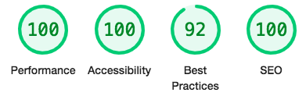

# Nowlan Sporthorses

This website provides it's users with information on a horse to use for breeding purposes.

The sites' target audience is people who:

* want to find out more about our resident stallion. 

* want to see who we are and what we offer.

* want to find out where we are to visit.

* want to send us a enquiry for a contract to read through in reagrds to using our stallion.

## *Features*

The webiste consists of three webpages:

* Home
* Stallions
* Bookings

## *Home Page*

  - The Home page has a wonderfully inviting picture of horses in a field. On this picture we have the title of the business and the navigation bar aswell as the details of our Easter Special for the selling of horse semen for breeding purposes.

- __Navigation Bar__

  - This is included on three pages. The navigation bar icons are highlighted in a different color and are underlined as you hover over them. They take you to the other two responsive pages on the website. the full responsive navigation bar includes links to the Logo, Home page and all other pages. The navigation bar is identical in each page to allow for easy navigation. 

   

- __Navigation links pages__

      - [Home](https://8000-katenowlan-nowlansportho-8mby1qhsl37.ws-eu38.gitpod.io/index.html)
   
      - [Stallions](https://8000-katenowlan-nowlansportho-8mby1qhsl37.ws-eu38.gitpod.io/stallions.html) 
    
      - [Bookings](https://8000-katenowlan-nowlansportho-8mby1qhsl37.ws-eu38.gitpod.io/bookings.html)     

   __Home Page Content__
   
   - Our Mission 

    This is our companies ethos and who we are.

    

   - What we offer? 

    What we offer potential clients as a business.

    

    - Meet the Team 

    Introducing the owner and adding a bit of personality/humour adding the dog as part of the team.

    

   - After the main content at the bottom of the page is text with our address and a embedded map of where to find us. Also added is some text welcoming clients to come visit us. In the background is a inviting picture of the farm at sunset enticing clients to come visit.

       

   - Almost at the bottom of the Home page there is a 'back to the top' link which when pressed takes you back to the top of the page. Very handy as it stops you from wasting time having to scroll all the way back up.

   

   - And lastly at the bottom of the page are the social media icons which whe clicked take you to theit corresponding social media websites. These open in a new tab.

   

## *Stallions Page*

  - a headline announcing the stallion at stud.

  - His name and breeding in brackets is mentioned.

  - The next part is full of short bullet points of information in regards to the stallion.

  - Following on is a picture of the stallion next to the bullet point text.

   

  - Next on this page is a section used a gallery with three pictures in a row of the stallion at different angles.

  

## *Bookings Page*

  - This is a form for users to fill in their details and we will respond to them with our booking contract for them to peruse the terms and conditions.

  - Added above this is text stating when the Easter Special offer for LFG (live foal guarentee) finishes. 

   

### **Testing**
 -   This website works works on :

 Screens 600px and below

 Screens 900px and below

 Screens 900px and above

__Validator Testing__

   - W3C HTML

   - CSS Jigsaw

   

   - Lighthouse 

    
    - Mobile screenshot

 

    
    - Desktop screenshot
    

      
