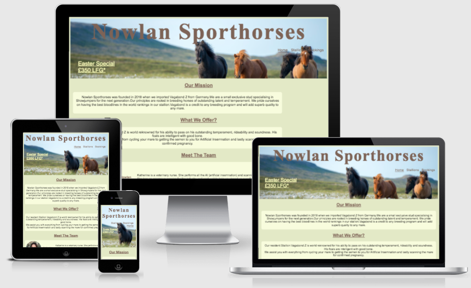
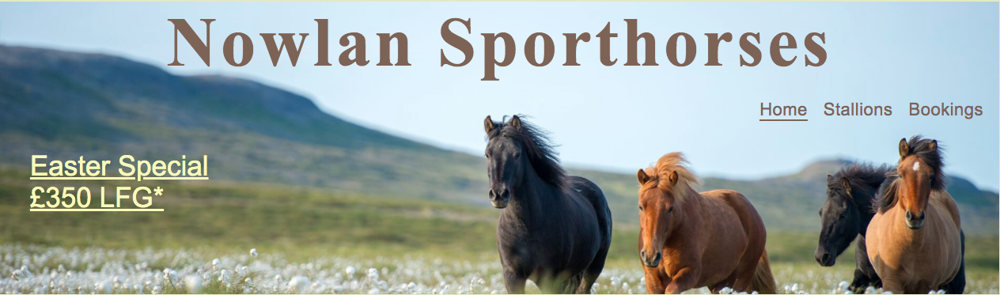
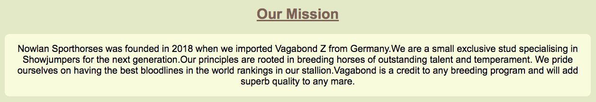
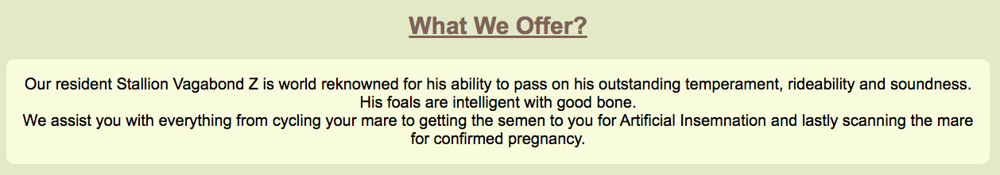
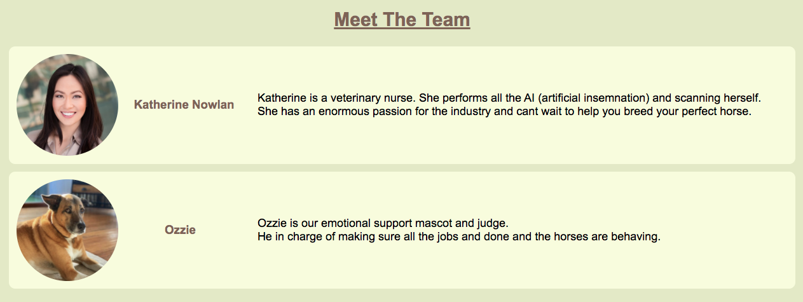
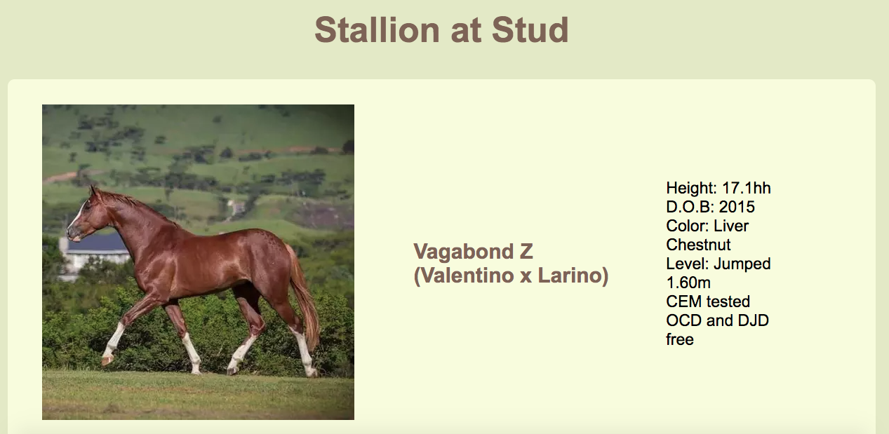
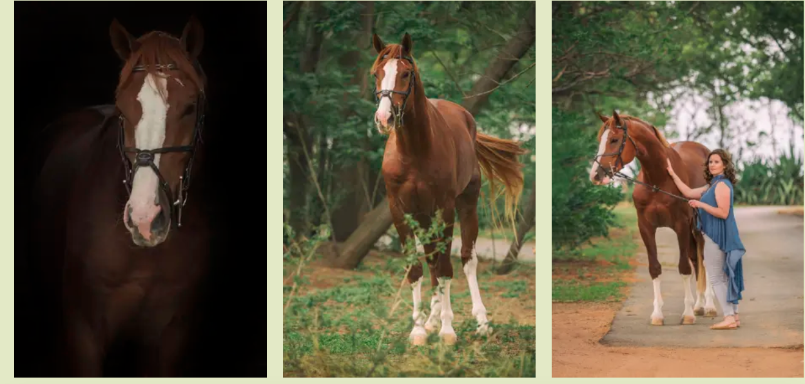
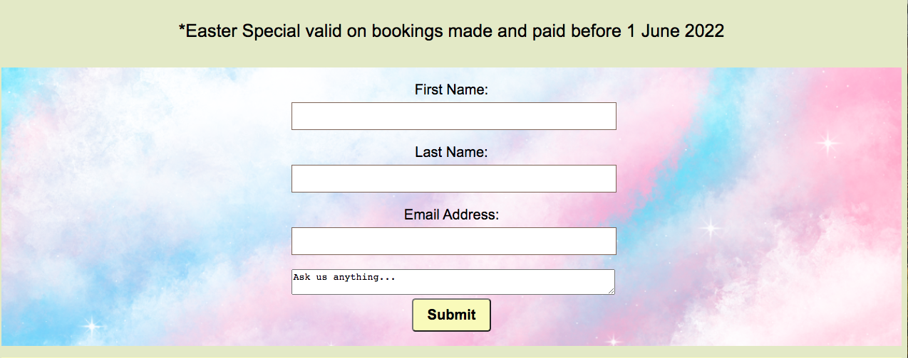

# Portfolio Project 1 - HTML and CSS Essentials

# Nowlan Sporthorses

This website provides it's users with information on a horse to use for breeding purposes.

**The website is live on Github Page [Nowlan Sporthorses](https://katenowlan.github.io/Nowlan-Sporthorses/)**

## Strategy plane

The sites' target audience is people who:

* want to find out more about our resident stallion. 

* want to see who we are and what we offer.

* want to find out where we are to visit.

* want to send us a enquiry for a contract to read through in reagrds to using our stallion.

First Time Visitor Goals
   1. Understand the site easily. 
   2. Navigate the site easily. 
   3. Simple and easy steps to make an enquiry.
   4. Ensure returning visitors from ease of use.

Returning Visitor Goals
   1. Return to review information on stallion.
   2. Enquire about other questions relating to the stallion.
   3. Find information about specials on stallion.  

### Clients Objectives 

The client,Katherine Nowlan of Nowlan Sporthorses,would like the site to:
   1. Present a professional brand to prospective and existing clients.
   2. Encourage bookings of the stallion for breeding purposes.
   3. Be informative and easy to understand and navigate.

## *User Accessibility*

 __From a users perspective the site must:__

* Have a eye-catching design.
* Have information that is easily accesible.
* Have information that is current and meaningful.
* Have content that is not overwhelming.
* Have a balance between pictures and text.
* Have information on how to get hold of the author of the website.
* Have social media channels to click on to follow.

## Structure plane

The webiste consists of three webpages:

* Home
* Stallions
* Bookings

## Skeleton plane

### *Wireframes*

I drew up a mock website so i could plan where i wanted everything to be put and whether the layout would flow.

  * 

  *  

## Surface plane

### *Color Theme*

The colour palette chosen is:
<ol>
<li>bright</li>
<li>contrasting</li>
<li>easy on the eye</li>

 
- This dark brown contrasts great with the pale yellows. It was used for the main headers.

 
 - This light yellow was used for the section containers and it makes the font stand out against it  which was kept black for contrast.

 
 - This lemon yellow was used for the background. It is subtle and just makes everything pop out of it.

# *Features*

## *Home Page*

  - The Home page has a wonderfully inviting picture of horses in a field. On this picture we have the title of the business and the navigation bar aswell as the details of our Easter Special for the selling of horse semen for breeding purposes.

- __Navigation Bar__

  - This is included on three pages. The navigation bar icons are highlighted in a different color and are underlined as you hover over them. They take you to the other two responsive pages on the website. the full responsive navigation bar includes links to the Logo, Home page and all other pages. The navigation bar is identical in each page to allow for easy navigation. 

   

- __Navigation links pages__

      - [Home](https://katenowlan.github.io/Nowlan-Sporthorses/index.html)
   
      - [Stallions](https://katenowlan.github.io/Nowlan-Sporthorses/stallions.html) 
    
      - [Bookings](https://katenowlan.github.io/Nowlan-Sporthorses/bookings.html) 
   

   __Home Page Content__
   
   - Our Mission 

    This is our companies ethos and who we are.

    

   - What we offer? 

    What we offer potential clients as a business.

    

    - Meet the Team 

    Introducing the owner and adding a bit of personality/humour adding the dog as part of the team.

    

   - After the main content at the bottom of the page is text with our address and a embedded map of where to find us. Also added is some text welcoming clients to come visit us. In the background is a inviting picture of the farm at sunset enticing clients to come visit.

       

   - Almost at the bottom of the Home page there is a 'back to the top' link which when pressed takes you back to the top of the page. Very handy as it stops you from wasting time having to scroll all the way back up.

   

   - And lastly at the bottom of the page are the social media icons which whe clicked take you to their corresponding social media websites. These open in a new tab.

   

## *Stallions Page*

  - a headline announcing the stallion at stud.

  - His name and breeding in brackets is mentioned.

  - The next part is full of short bullet points of information in regards to the stallion.

  - Following on is a picture of the stallion next to the bullet point text.

   

  - Next on this page is a section used a gallery with three pictures in a row of the stallion at different angles.

  

## *Bookings Page*

  - This is a form for users to fill in their details and we will respond to them with our booking contract for them to peruse the terms and conditions.

  - Added above this is text stating when the Easter Special offer for LFG (live foal guarentee) finishes. 

   

### **Testing**
 -   This website works works on :

 Screens 400px and below
 
 Screens 600px and below

 Screens 900px and below

 Screens 1200px and below

 Screens 1200 and above

__Validator Testing__

   - W3C HTML

   - CSS Jigsaw

   

   - Lighthouse 

    
    - Mobile screenshot

 

    
    - Desktop screenshot
    

  The website was tested on the following platforms to see if it worked:
  * Chrome
  * Safari

  I used developer tools alot to check accesibility and responsiveness.

  I had a couple issues along the way with learning the correct code for html and css. This was overcome by trial and error putting in the code and seeing how it affected the website.

  If i had a couple divs open in a section i needed to pay close attention to making sure all of them were closed otherwise this affected my websites layout in the sections.

 ### *Colors*

      * I used a color validator to make sure the contrast of colors on the website is balanced.

      

# **Testing and Debugging**

I used to following platforms to test whether my website was working:

* Chrome 
* Safari

I used developer tools alot to help me with responsiveness and accesibility issues.

I mostly learnt just by trial and error.

Googling the code for something i wasnted to do and then adjusting as and where i need worked very well.

A fault i had to learn very quick was my inability to close divs. If i had three or so divs in a section i needed to make sure they were all closed.

# **Unfixed bugs**

* I have tried a whole host of things but i cannot get the banner image to resize with the text when viewed on any smaller screens.

# **Deployment**

 * On GitHub main page click on your repository.
 * Click on settings
 * This takes you to GitHub Pages.
 * On the section with the title "Source",click the arrow and you have 3 options:
 * Select Branch: main
 * Select Folder: /(root)
 * Click save: your website will be deployed.

 ## Clone and Fork

### Clone 

* In Github, click on the project that you want to clone.
* Click to copy the URL.
* Open a new terminal.
* Change the current working directory to the location that you want the cloned directory.
* Type 'git clone' and paste the copied URL.
* Press 'Enter' to clone.

### Fork

* In Github, click on the project that you wish to fork.
* Click on the 'Fork' button at the top right of the page.

# **Research**

 * Websites sourced from Google used for information were:
 - Stack overflow
 - W3C

 # **Credit**

 * Thanks must go to my mentor Okwudiri Okoro for all his guidance.

  # **Media**

  The pictures of the horses are all personal pictures i have taken myself.

  The banner image is from:

  [animal talk website](https://www.google.co.uk/url?sa=i&url=https%3A%2F%2Fwww.animaltalk.com.au%2Fgallery%2Fhorse-banner%2F&psig=AOvVaw3RWX_hM_NXqF3G8zJSqjoZ&ust=1648713939162000&source=images&cd=vfe&ved=0CAgQjRxqFwoTCPDfz5ew7fYCFQAAAAAdAAAAABAE)

  The fields image is taken from:

  [field picture on website](https://dz2cdn1.dzone.com/storage/temp/12876949-pic-field-in-fall.jpg)

